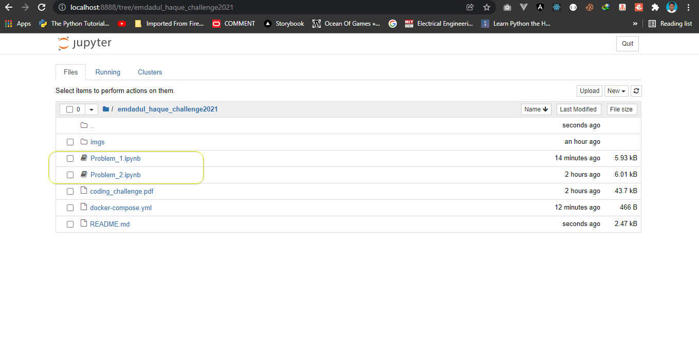

 # Table of Contents
 
- [Problem Statement](#Problem-Statement)
- [My Solution](#My-Solution)
- [How Can You Run ?](#How-Can-You-Run-)
   - [Easy Way With Google Colab](#Easy-Way-With-Google-Colab)
   - [Running with docker](#Running-with-docker)
   - [Running with your PC (Tested on Windows 10 Pro)](#running-with-your-pc-tested-on-windows-10-pro)


# Problem Statement

There are 2 problem statement. For seeing problem statement, you can [click here](./coding_challenge.pdf). 

# My Solution 

| Problem      | Link |
| ----------- | ----------- |
| Problem 1      | [Problem 1  Solution Link](./Problem_1.ipynb)       |
| Problem 2      | [Problem 1  Solution Link](./Problem_2.ipynb)       |

# Language Used

* Python 3
* Jupyter notebook

# How Can You Run ?

## Easy Way With Google Colab.

### Prerequisite 

* Knowledge about google colab
* Web browser
* Basic idea of GitHub

### Running process 
1. Go the this link. [Click here](https://github.com/Rafat97/rafat97-content-static/tree/main/Notebook/emdadul_haque_challenge2021)

2. Select the any of file [`Problem_1.ipynb`]((./Problem_1.ipynb)) or [`Problem_2.ipynb`]((./Problem_2.ipynb)).

3. Click open in colab. I gave a sample screenshot how this button/shield looks like. 


4. After clicking this button/shield. The notebook will open a google colab. From here you can run my code. You don't need any kinds of environment setup. Just login your google account and run the code cell and you can saw the output.


## Running with docker

### Prerequisite 

* docker and docker-compose
* Web browser
* Basic knowledge about jupiter notebook

### Running process 
1. First run docker commend. It will download `jupyter/scipy-notebook` image from docker hub. After downloading image a new container will be created. The commend is-

```bash
docker-compose up -d --build
```

2. Wait 1-2 minutes for docker configuration.

3. Then, open browser and type this link-

```bash
http://localhost:8888/tree/emdadul_haque_challenge2021
```

4. In this link you can see all the `.ipynb` files. I gave a SS-




4. Then, You can run any of the problem you want. 


## Running with your PC (Tested on Windows 10 Pro)

### Prerequisite 

* Already installed python3 [Tested on python v3.9.6]
* Basic knowledge about commend

### Running process 
1. First go to this path-
```bash
[YOUR_ABSOLUTE_PATH_OF_FOLDER]\emdadul_haque_challenge2021\py
```
Example-
```bash
C:\Users\Rafat\Desktop\emdadul_haque_challenge2021\py
```

2. Then open `cmd` or `powershell` and run -

For problem 1 -
```bash
python .\problem_1.py
```

For problem 2 -
```bash
python .\problem_2.py
```

